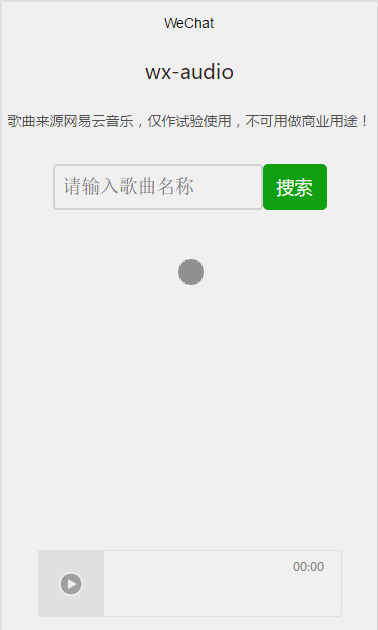

# wx-audio

[](https://travis-ci.org/xingbofeng/wx-audio)

It‘s a Music-Player built with weixin-app.

[中文文档](./README_ZH.md)

## Screenshots



## Environment
`Node.js` 6.0+

Warning: Because I use some grammar of es6, you should update the version of your `Node.js`, this project is only supported `Node.js 6.0+`.

## Directory
- `pages/`: Pages of this application.
- `server/`: The Back-End of this application，I had deployed it to my own Cloud Server(`https://encounter.studio:3000`, http method is `POST`，param is `musicname`), you can use it freely.
- `test/`: Unit test code.

## Quickly Start
* Download The tool of Weixin development.
[Click here to download](https://mp.weixin.qq.com/debug/wxadoc/dev/devtools/download.html)
* Clone this project
```
git clone https://github.com/xingbofeng/wx-audio.git
```
* Start the server on your local environment

Warning: I had deployed it to my own Cloud Server(`https://encounter.studio:3000`, http method is `POST`，param is `musicname`).If you want to run the server in your local environment, please modify `wx.request` of `pages/index/index.js` to `http://localhost:3000`, then `yarn start`.


```
yarn install
yarn start
```
* Unit test
The code of test at `test/`, under the environment of `mocha`:

```
yarn install -g mocha
yarn test
```

* Open The tool of Weixin development.
* Run it in your tool.

## To Do List
- [x] Add `Node.js`
- [x] Add Unit Test
- [x] The List of music
- [ ] Search User / Singer / Playlist
- [ ] Control the speed of music playing

## API documents

### URL
**GET http://music.163.com/api/search/get/**

### params
```
s: The keyword of Searching.
limit: The mounts of you want to get.
sub: Please set it `false`.
type: Types, see the list as follows.

1 Music
10 Album
100 Singer
1000 Playlist
1002 User
```
### Example

```
http://s.music.163.com/search/get/?type=1&limit=5&s=%E5%91%8A%E7%99%BD%E6%B0%94%E7%90%83
```
The result is as follows:
```json
{
  "result": {
    "songCount": 2275,
    "songs": [
      {
        "id": 440241144,
        "name": "告白气球",
        "artists": [
          {
            "id": 1081635,
            "name": "周二珂",
            "picUrl": null
          }
        ],
        "album": {
          "id": 34986028,
          "name": "告白气球",
          "artist": {
            "id": 0,
            "name": "",
            "picUrl": null
          },
          "picUrl": "http://p1.music.126.net/m3_elKryq_x62UNHJ2NgHg==/109951162807555886.jpg"
        },
        "audio": "http://m2.music.126.net/GvIMZ5ZW0l04xFMVYtTy8g==/18502581673300022.mp3",
        "djProgramId": 0,
        "page": "http://music.163.com/m/song/440241144"
      },
      {
        "id": 434070713,
        "name": "告白气球 ",
        "artists": [
          {
            "id": 1073042,
            "name": "王进",
            "picUrl": null
          }
        ],
        "album": {
          "id": 34801227,
          "name": "告白气球",
          "artist": {
            "id": 0,
            "name": "",
            "picUrl": null
          },
          "picUrl": "http://p1.music.126.net/cIim8rAhdKV1Up7e9zSFoA==/17647161626137638.jpg"
        },
        "audio": "http://m2.music.126.net/zp5J-qWfkwmBd2pq3pHzCw==/18605935765863165.mp3",
        "djProgramId": 0,
        "page": "http://music.163.com/m/song/434070713"
      },
      {
        "id": 421137034,
        "name": "告白气球",
        "artists": [
          {
            "id": 1158065,
            "name": "宇西",
            "picUrl": null
          }
        ],
        "album": {
          "id": 34778501,
          "name": "告白气球（Cover 周杰伦）",
          "artist": {
            "id": 0,
            "name": "",
            "picUrl": null
          },
          "picUrl": "http://p1.music.126.net/tlp3VWVQVe0Je1r-oHn91g==/17666952835430891.jpg"
        },
        "audio": "http://m2.music.126.net/8egvCxWVy4vzk2EJG_dGqg==/3265549609864401.mp3",
        "djProgramId": 0,
        "page": "http://music.163.com/m/song/421137034"
      },
      {
        "id": 429461789,
        "name": "告白气球",
        "artists": [
          {
            "id": 975714,
            "name": "叶洛洛",
            "picUrl": null
          },
          {
            "id": 12126098,
            "name": "Vk",
            "picUrl": null
          }
        ],
        "album": {
          "id": 34872359,
          "name": "告白气球",
          "artist": {
            "id": 0,
            "name": "",
            "picUrl": null
          },
          "picUrl": "http://p1.music.126.net/PuNMFpLHzvHw2v0-Zh2b8g==/18244196440128259.jpg"
        },
        "audio": "http://m2.music.126.net/t_qlmZ581WF2MwHmvUavxA==/2946691220790691.mp3",
        "djProgramId": 0,
        "page": "http://music.163.com/m/song/429461789"
      }
    ]
  },
  "code": 200
}
```


## Change Log
* 0.0.1 :tada:Deploy;
* 0.0.2 Add Unit test;
* 0.1.0 Finish the List of music;
* 0.1.1 Add English documents, And use `yarn` to build this application;

## LICENSE
[MIT LICENSE](./LICENSE)
